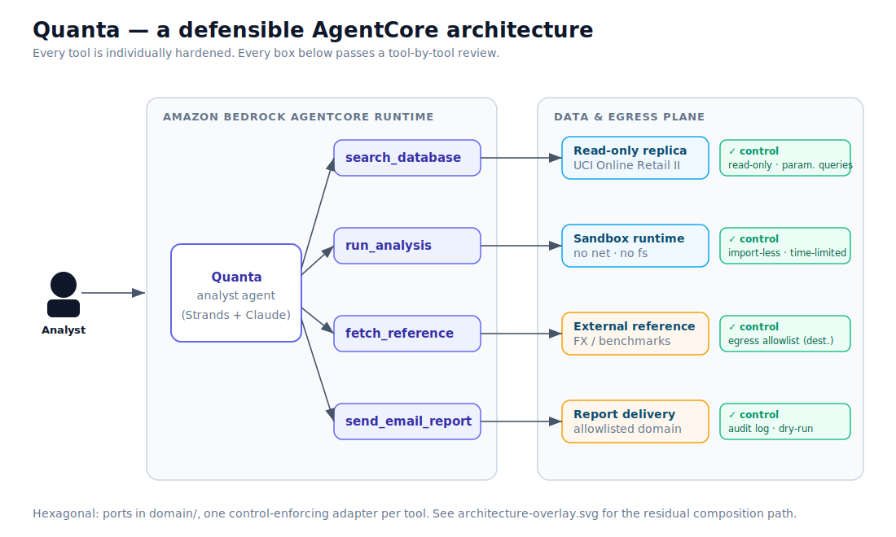

# Architecture

Quanta is built with a **hexagonal (ports & adapters)** architecture, kept
deliberately small. The shape matters for the lesson: the controls live on clean
boundaries, so the system *reads as well-engineered* — and the residual risk is
visibly **not** a sloppy tool, but the composition.



## Layers

```
agent.py                   AgentCore entrypoint (BedrockAgentCoreApp + @entrypoint)
        │  depends on
        ▼
tools.py                   four thin callables (the agent's capabilities)
        │  depend on
        ▼
domain/ports.py            interfaces: MetricsRepository, CodeRunner,
                           ReferenceData, ReportDelivery   (no I/O)
        ▲  implemented by
        │
adapters/                  one adapter per port — each enforces ONE control
```

- **domain/** — pure interfaces and value objects. No SQL, no HTTP, no framework.
  `ReferenceDocument.trusted` is hard-wired `False`: the type system itself
  records that external content is never trustworthy.
- **adapters/** — the only place with I/O. Each adapter is where a *declared
  defence* is enforced:
  - `ReadOnlyMetricsRepository` — `mode=ro` connection + a parameterised query
    builder (the model picks a metric key, never writes SQL) + a row cap.
  - `SandboxedCodeRunner` — a tiny builtins allowlist, no imports, no network,
    no filesystem. Intentionally *not* a general REPL.
  - `AllowlistedReferenceData` — an egress allowlist on the destination host.
  - `AuditedReportDelivery` — recipient-domain allowlist + append-only audit log
    + dry-run by default.
- **`agent.py`** — the AgentCore `@app.entrypoint`. On AWS it drives a Strands
  agent backed by a Bedrock Claude model; locally it uses a deterministic stub so
  the agent runs (and can be scanned) with no cloud dependency. **The tool set is
  identical in both paths.**

## Why a clean architecture still fails

Each boundary above is individually defensible. But the agent's *composition
surface* — which tool outputs can flow into which tool inputs — forms a graph:

```
 search_database ─┐
 (private data)   ├─▶ run_analysis ─▶ send_email_report   (external channel)
 fetch_reference ─┘                    ▲
 (untrusted)      └────────────────────┘
```

An LLM agent can sequence these freely. That means a single graph carries the
**lethal trifecta**: access to private data (`search_database`), exposure to
untrusted content (`fetch_reference`), and an external communication channel
(`send_email_report`). An indirect prompt injection arriving via untrusted
content can steer the agent down a chain of *individually authorised* actions to
exfiltrate data — and every per-tool control still holds.

ZIRAN analyses exactly this graph. See [`threat-model.md`](threat-model.md) for
the control/residual table and [`architecture.svg`](architecture.svg) (and its
`architecture-overlay.svg` reveal variant) for the diagram used in the talk.
